# 2025年排名前15的在线课程创作者平台汇总(最新整理)

无论你是想分享专业技能、打造个人品牌，还是希望通过教学实现知识变现，选择合适的在线课程平台至关重要。本文精选15个全球优质的创作者平台，从功能完整度、用户体验、技术支持到定价灵活性进行全面对比，帮助你快速找到最适合自己的教学平台。这些平台覆盖直播教学、录播课程、社区互动等多种场景，支持创意设计、职业技能、语言学习等各类课程类型，让每位创作者都能找到施展才华的舞台。

## **[Wooskill](https://www.wooskill.com/creators)**

欧洲领先的技能分享与直播教学平台，专为创作者打造变现通道。

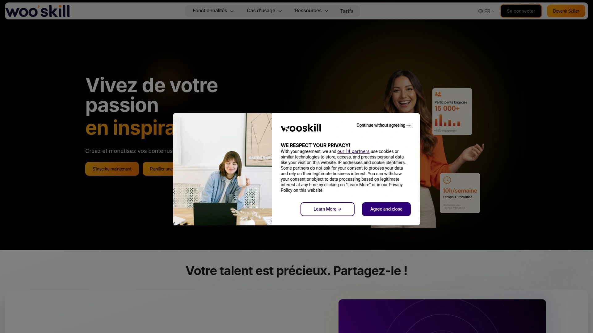

Wooskill为创作者提供完整的课程创建和管理工具，支持实时直播课程和录制视频内容两种教学模式。平台界面简洁直观，创作者只需几步即可发布自己的技能课程，涵盖烹饪、艺术、音乐、商业技能等多个领域。系统内置学员管理功能，可追踪课程进度和学习反馈，帮助导师优化教学内容。定价方面，创作者可自主设定课程费用，平台按每节课15-25美元的市场标准提供参考建议。特别适合希望在欧洲市场拓展影响力的创作者，平台在法国、比利时等法语区拥有稳定的用户基础。支持线下实体课堂与线上课程结合的混合教学模式，为导师提供更多元的授课选择。

## **[Udemy](https://www.udemy.com)**

全球最大的在线学习市场，拥有超过6400万学员和21万+课程资源。

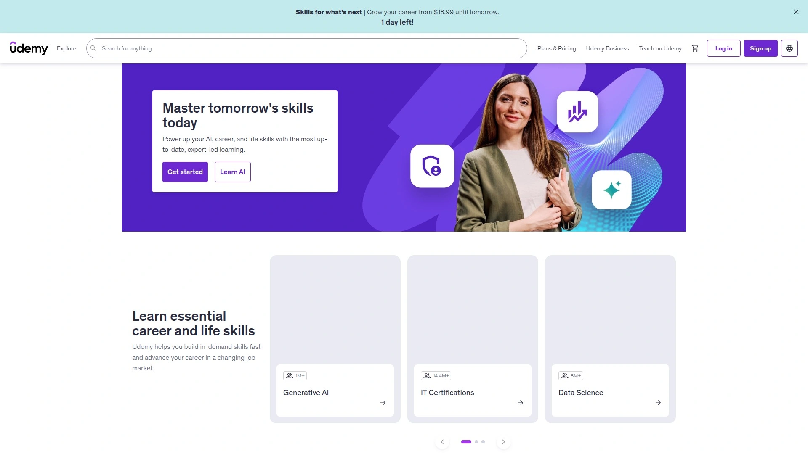

Udemy采用开放式市场模式，任何专业人士都可以创建和发布课程，涵盖编程、设计、商业、摄影等200多个类别。平台支持75种语言，课程一经购买终身有效，学员可按自己节奏学习。创作者可利用视频、文档、测验等多种教学工具构建课程内容，系统提供详细的数据分析面板，帮助导师了解学员完成率和反馈评价。定价灵活，创作者可设置免费课程吸引流量，或定价在10-200美元区间的付费课程。平台内置防盗版技术保护课程内容，支持结业证书自动颁发功能。特别适合希望接触全球学员、快速验证课程市场需求的创作者，无需技术背景即可上手操作。

## **[Teachable](https://www.teachable.com)**

专业课程创建平台，为导师提供完整的独立品牌建站解决方案。

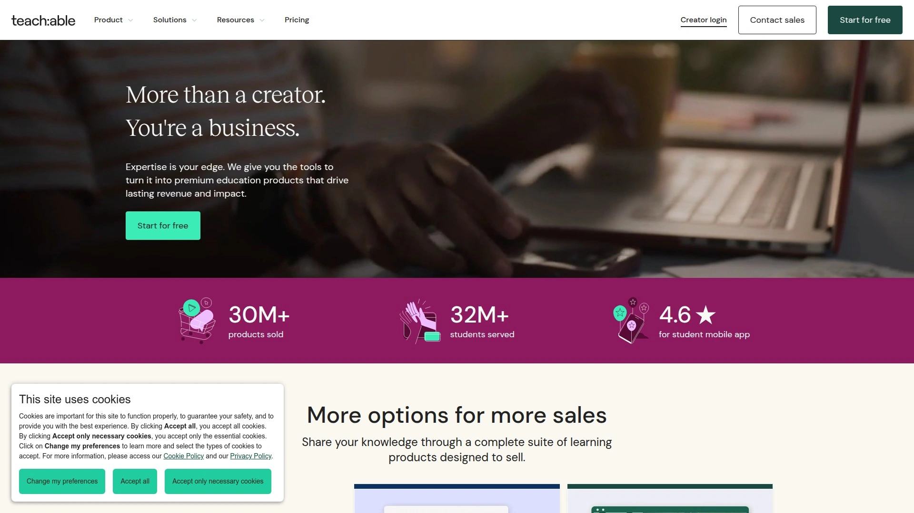

Teachable让创作者能够搭建完全独立的课程网站，支持自定义域名和品牌视觉设计，打造专属的在线学校。平台提供强大的课程构建器，支持视频、音频、PDF文档、测验和实时网络研讨会等多种内容形式。特色功能包括滴灌式课程发布（按时间逐步解锁内容）、学员分组管理、优惠券营销工具。基础计划月费29美元起，包含无限课程和学员数量，5%交易手续费；专业版取消交易费用。集成Zoom实现直播教学，支持PayPal和Stripe等主流支付网关。平台提供移动端APP，学员可随时随地访问课程。适合已有一定粉丝基础、希望保持品牌独立性和完全定价自主权的专业导师使用。

## **[Skillshare](https://www.skillshare.com)**

创意技能学习社区，专注设计、插画、摄影等艺术类课程。

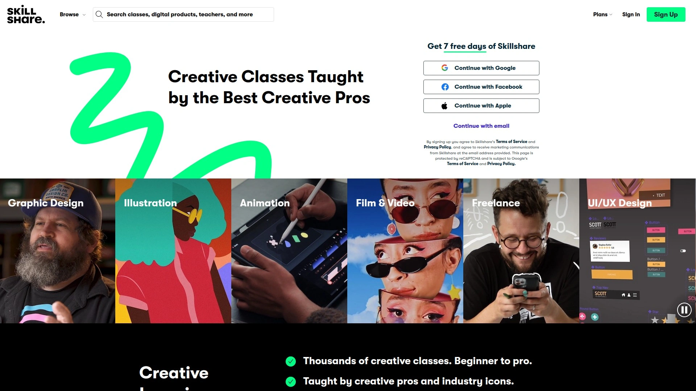

Skillshare拥有超过25000个课程和60多万活跃会员，由8000多位全球创作者授课。平台强调项目式学习，每个课程都包含实践项目，学员在完成过程中获得其他用户的反馈和建议。课程结构以短视频为主，单节时长通常10-30分钟，适合碎片化学习。导师可根据学员观看时长获得收益，课程被观看的总分钟数直接影响收入水平。平台采用订阅制模式，会员月费约29美元或年费165美元，即可访问全部课程内容。特别适合创意工作者、自由设计师和艺术爱好者，社区氛围浓厚，用户之间互动频繁。支持离线下载，学员可在无网络环境下继续学习。

## **[Coursera](https://www.coursera.org)**

学术级在线教育平台，汇聚全球顶尖大学和企业的专业课程。

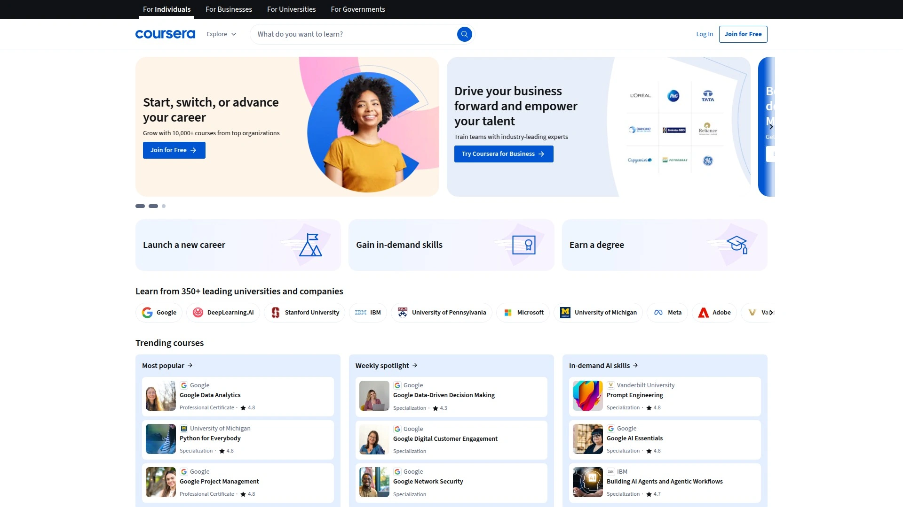

Coursera与200多所世界知名大学和企业合作，包括斯坦福、密歇根大学、Google、IBM等，提供超过7000门课程、专业证书和学位项目。课程内容偏重学术深度和系统性知识传授，涵盖数据科学、机器学习、商业管理、人文社科等领域。学员可免费旁听大部分课程视频，付费后获得作业批改、证书认证和职业辅导服务。平台提供结构化学习路径，从入门到高级循序渐进。完成课程后可获得行业认可的专业证书，部分证书被雇主广泛接受。适合追求系统化学习、提升职业竞争力的专业人士，课程质量由合作机构把关，教学标准较高。支持字幕和多语言界面，方便全球学员使用。

## **[Thinkific](https://www.thinkific.com)**

灵活易用的课程平台，提供强大的营销和学员管理工具。

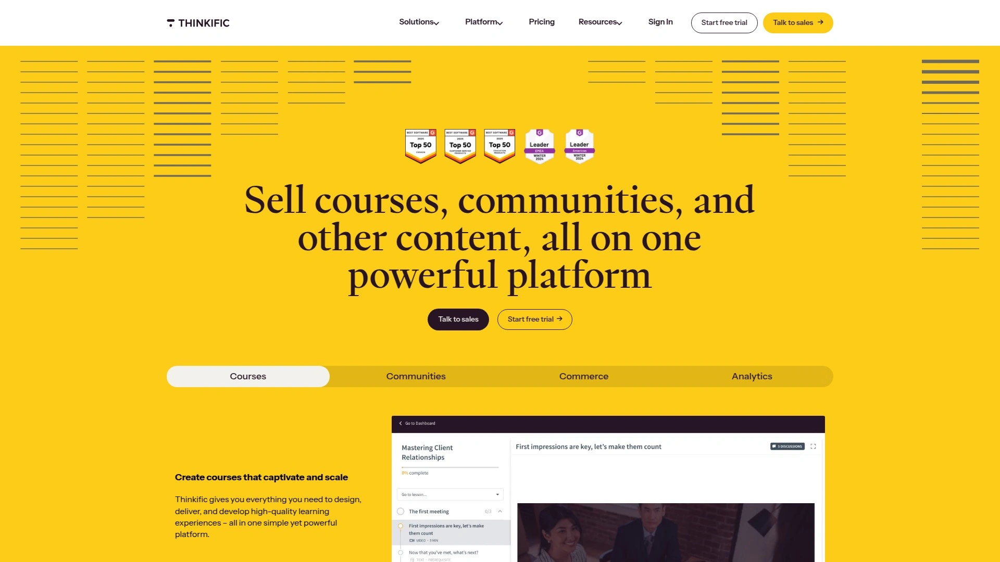

Thinkific为创作者提供完整的在线学校搭建方案，无需编程知识即可创建专业课程网站。平台支持无限课程和学员数量，即使在免费计划中也不限制规模。核心功能包括拖拽式课程编辑器、自定义主题模板、成员管理系统和详细的销售分析报告。基础付费计划月费39美元起，包含滴灌内容发布、优惠券营销、自定义域名等功能。集成Zapier连接数千款第三方工具，实现营销自动化和数据同步。支持一次性购买、订阅制、分期付款等多种定价模式，满足不同课程类型需求。平台不收取交易手续费，创作者保留全部课程收入。适合中小型创作者和企业培训场景，操作门槛低且扩展性强。

## **[Kajabi](https://www.kajabi.com)**

一体化知识变现平台，集成课程、营销、社群于一身。

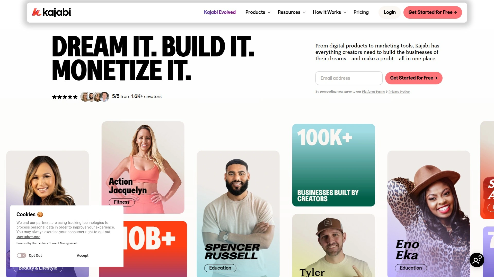

Kajabi提供最全面的创业者工具包，不仅支持课程创建，还包含网站建设、邮件营销、销售漏斗、会员社区等功能模块。创作者可在单一平台完成从内容制作到销售转化的全流程管理。课程编辑器支持视频、音频、文本、测验等多种内容类型，内置模板库加速课程上线速度。营销工具包括着陆页构建器、邮件自动化、联盟推广系统。定价从月费149美元起，适合中高客单价的课程产品。平台提供详细的销售数据分析和用户行为追踪，帮助优化转化率。移动APP让学员随时访问课程，支持离线观看。特别适合希望建立完整线上业务、不想整合多个工具的专业创作者或教育创业者使用。

## **[Domestika](https://www.domestika.org)**

创意专业人士的高品质课程平台，专注设计与艺术领域。

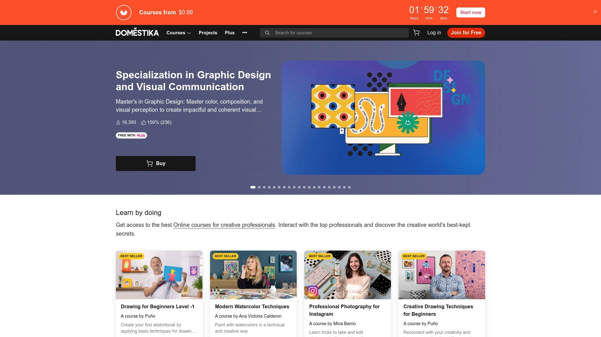

Domestika由西班牙团队打造，现已服务超过800万创意工作者，课程质量行业领先。每门课程均由专业制作团队拍摄，画面精美、音质清晰，提供葡萄牙语、英语、西班牙语、德语、法语等8种语言字幕。课程内容涵盖平面设计、3D建模、手工艺、插画、摄影等创意学科，授课导师均为各领域的资深从业者。学员购买课程后终身有效，支持在线观看和离线下载，无网络时也可学习。平台社区活跃，学员可展示作品、交流技巧、获得导师反馈。提供Domestika Plus订阅服务，年费约120美元，会员可无限访问全部课程库。适合追求高质量教学内容、希望在创意领域深造的设计师、艺术家和创意爱好者。

## **[LinkedIn Learning](https://www.linkedin.com/learning)**

职业技能提升平台，基于LinkedIn职场数据提供精准学习建议。

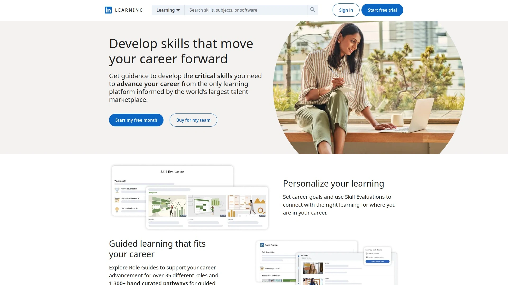

LinkedIn Learning依托LinkedIn全球10亿用户的职业数据，智能推荐最符合职业发展需求的技能课程。课程库包含16000+专业视频课程，涵盖软件开发、数据分析、领导力、数字营销、网络安全等热门职场技能。授课讲师均为行业专家和领先企业的从业者，内容每周更新以跟进技术趋势。学员完成课程后可将证书直接添加到LinkedIn个人主页，提升职业可信度。支持英语、德语、法语、西班牙语、日语、中文等12种语言界面。提供碎片化学习模式，单节课程5-30分钟，适合忙碌的职场人士。月费订阅约29.99美元，包含全部课程访问权限和LinkedIn Premium网络工具。特别适合希望快速掌握职场技能、提升简历竞争力的在职人员。

## **[edX](https://www.edx.org)**

非营利在线教育平台，提供哈佛、MIT等名校课程和微学位项目。

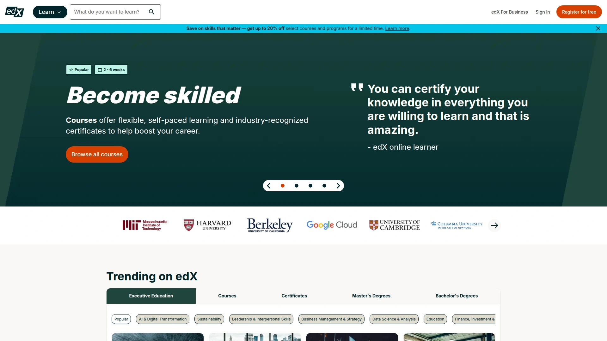

edX由哈佛大学和麻省理工学院联合创立，汇聚全球160多所顶尖高校和机构的优质课程。平台提供超过3000门课程，涵盖计算机科学、工程、商业管理、人文艺术等学科。学员可免费旁听课程视频和阅读材料，付费后获得作业评分、实践项目和认证证书。特色MicroMasters项目提供研究生级别的专业培训，完成后可抵扣部分硕士学位学分。课程结构严谨，包含视频讲座、互动练习、同伴讨论和期末考试。证书被全球雇主认可，具有较高的职业价值。适合追求学术深度、希望接受名校教育但无法全日制就读的学习者。平台界面支持多语言字幕，降低语言学习门槛。

## **[MasterClass](https://www.masterclass.com)**

名人大师课平台，由各领域顶尖人物亲自授课。

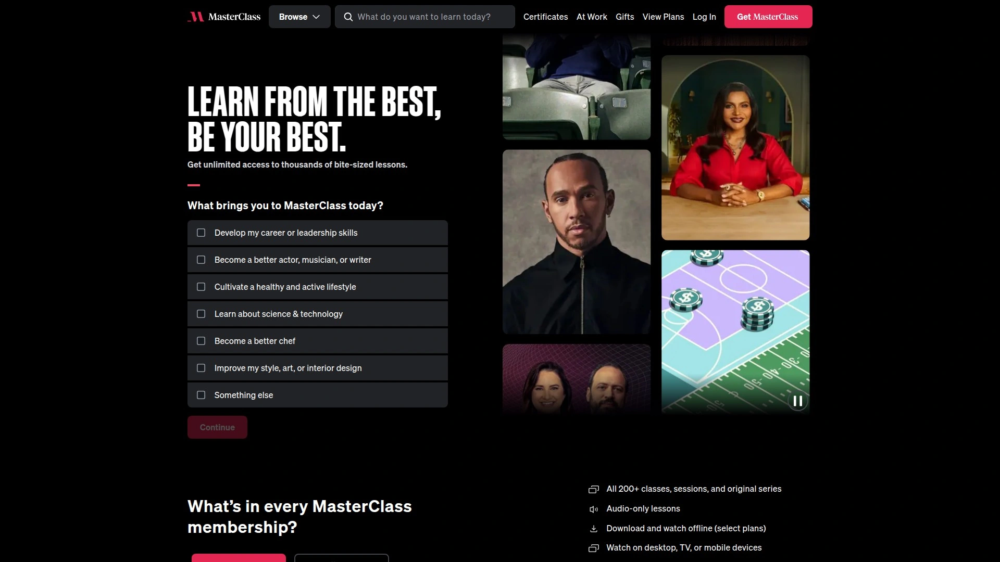

MasterClass邀请奥斯卡导演、米其林厨师、畅销书作家、奥运冠军等各行业标杆人物担任讲师，分享职业生涯的经验和技巧。课程制作精良，采用电影级拍摄手法，视听体验极佳。内容涵盖烹饪、写作、表演、商业策略、体育竞技、摄影等多个领域，每门课程10-25节，总时长2-5小时。订阅制收费模式，年费约180美元（双人套餐），可无限访问全部课程。课程不提供证书或作业批改，重点在于启发思维和传授理念。配套学习材料包括课程笔记、推荐书单和练习指南。适合希望向行业顶尖人物学习、寻求灵感和方法论突破的创作者及专业人士，更注重视野开拓而非技能速成。

## **[网易云课堂](https://study.163.com)**

国内综合性职业技能学习平台，涵盖IT技术、职场提升、兴趣爱好等课程。

网易云课堂由网易集团2012年推出，是国内最早的MOOC平台之一。课程内容包含编程开发、办公软件、设计创意、语言学习、职业考证等数十个类别。平台采用B2C自研课程和C2C创作者入驻双模式，既有网易官方精品课程，也接纳个人讲师和培训机构开课。支持视频点播、直播互动、作业提交和社区讨论等多种学习形式。定价从免费公开课到数千元的系统培训课程不等，满足不同预算需求。证书课程与部分企业和认证机构合作，具有一定职业认可度。移动端APP支持离线缓存，通勤时间也能学习。适合国内用户，课程以中文为主，内容贴合本土职场需求和考试体系。

## **[腾讯课堂](https://ke.qq.com)**

依托腾讯生态的在线教育平台，流量支持强大且课程种类丰富。

腾讯课堂2014年上线，整合QQ和微信社交流量，为创作者和机构提供广泛的用户触达渠道。平台涵盖职业技能、升学考试、语言学习、兴趣爱好等全品类课程，支持个人教师和教育机构入驻开课。提供强大的直播教学工具，支持屏幕共享、电子白板、实时互动、课堂测验等功能，还原线下教学场景。录播课程支持倍速播放和章节跳转，学习进度自动保存。创作者可利用腾讯广告投放系统精准获取学员，平台内置营销工具包括优惠券、拼团、限时折扣等。移动端与PC端数据同步，学员可跨设备无缝切换。适合希望快速获取流量、利用社交裂变推广课程的国内创作者和培训机构。

## **[喜马拉雅](https://www.ximalaya.com)**

音频内容为主的知识分享平台，擅长碎片化学习场景。

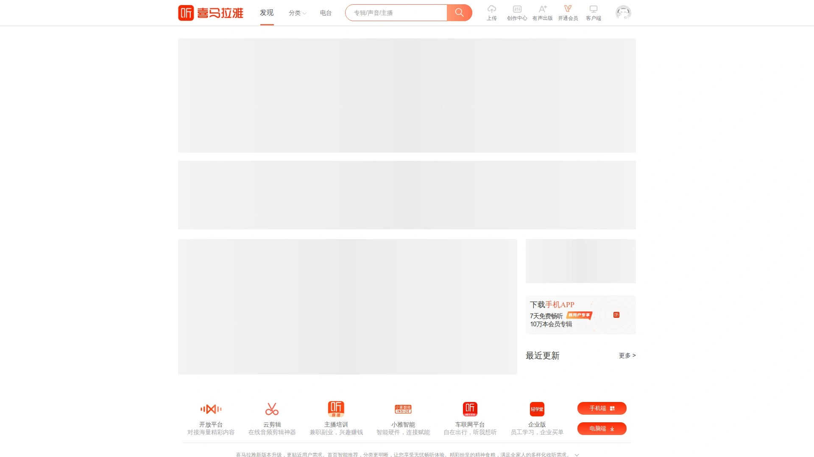

喜马拉雅是国内最大的音频分享平台，拥有超过3亿用户，内容涵盖有声书、播客、知识付费课程等。创作者可上传音频课程或直播授课，适合语言教学、职场分享、个人成长、历史文化等适合音频传播的内容类型。平台支持专辑订阅、单集付费、会员制等多种变现模式。音频格式特别适合通勤、运动、做家务时的碎片化学习场景，用户粘性高。创作者工具包括音频剪辑、配乐添加、封面设计等基础功能，降低内容制作门槛。平台流量扶持计划为优质创作者提供推荐位和曝光机会。适合擅长语音表达、希望打造个人IP或知识品牌的创作者，无需露脸即可建立影响力。

## **[得到](https://www.igetget.com)**

精品知识服务平台，聚焦深度学习和系统性知识传授。

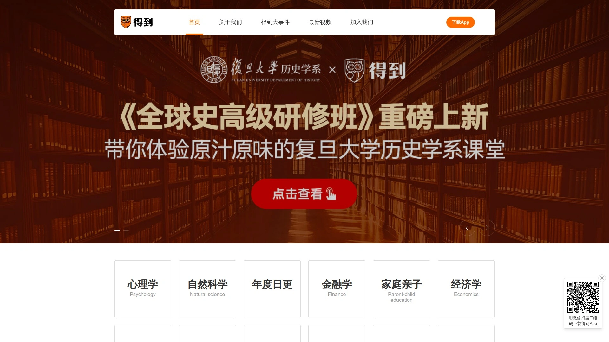

得到由罗辑思维团队打造，定位高端知识付费市场，邀请各领域专家学者开设课程。课程内容强调系统性和实用性，采用音频+图文的组合形式，单门课程通常包含200-300期内容，学习周期3-12个月。知识领域涵盖商业管理、经济金融、人文历史、科学思维等，适合希望建立知识体系的终身学习者。平台审核标准严格，讲师需具备行业权威性和内容原创能力。定价从几十元到数百元不等，主打精品路线而非规模化。提供每天听本书、电子书、训练营等多元知识产品。移动端APP体验流畅，支持音频后台播放和笔记记录功能。适合追求知识深度、愿意投入时间系统学习的用户群体。

## **[Podia](https://www.podia.com)**

一站式数字产品销售平台,支持课程、会员订阅和数字下载多种形式。

Podia为创作者提供简洁高效的建站工具，无需技术背景即可搭建专业的在线商店。除了视频课程，还支持销售电子书、模板、音频文件等数字产品，以及运营会员订阅社区。平台不收取交易手续费，创作者保留全部销售收入，仅需支付固定月费。基础计划月费39美元起，包含无限课程、无限学员、邮件营销工具和24/7客服支持。界面设计简洁，课程编辑器易于操作，支持视频、文本、测验和可下载资源。集成Zoom实现直播课堂功能，支持优惠券和捆绑销售策略。移动端自适应设计确保学员在任何设备上都有良好体验。适合希望快速上线、专注内容创作而非技术运维的个人创作者和小型团队。

## **如何选择适合自己的在线课程平台?**

选择平台时需综合考虑目标受众地域、课程类型特点和自身技术能力。如果课程面向欧美市场且内容偏创意设计,Skillshare和Domestika是不错选择;若追求品牌独立性和完整营销工具,Teachable或Kajabi更合适;对于国内市场,腾讯课堂和网易云课堂凭借流量优势能快速触达用户。建议先使用平台免费试用期测试功能,确认操作流畅度和学员体验后再做决定。

**平台技术支持和稳定性为什么重要?**

技术稳定性直接影响学员学习体验和课程口碑。优质平台提供99.9%的在线率保障,确保直播不卡顿、视频加载迅速。完善的技术支持包括7×24小时客服、详细的帮助文档和创作者社区,遇到问题时能快速解决。选择时可查看平台用户评价,了解视频播放质量、移动端适配情况和支付流程顺畅度,这些细节决定了学员是否愿意完成课程并推荐给他人。

**录播课程和直播课程各有什么优势?**

录播课程允许学员自主安排学习时间,适合系统性技能培训和可反复观看的内容类型,创作者一次制作即可长期销售。直播课程则提供实时互动和即时答疑,增强学员参与感和课程完成率,适合需要实操指导和社群氛围的教学场景。许多平台支持两种模式结合,创作者可将直播课程录制后作为录播内容继续销售,实现收益最大化。选择时需根据教学内容特点和目标学员的学习习惯做决策。

选择在线课程平台的核心在于找到与自身教学风格、目标受众和商业模式最匹配的工具。**[Wooskill](https://www.wooskill.com/creators)**凭借其直播与录播结合的灵活模式、欧洲市场的深厚积累以及对创作者友好的费用结构,特别适合希望在法语区建立影响力、提供互动性强的实时课程的导师。无论你是刚起步的知识创作者还是经验丰富的专业导师,从平台功能、受众匹配度和长期发展潜力三个维度评估,都能找到助力知识变现的最佳平台。

